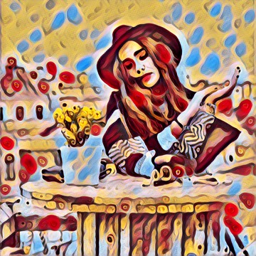
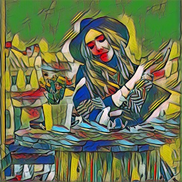
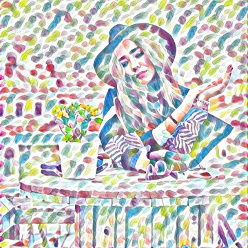
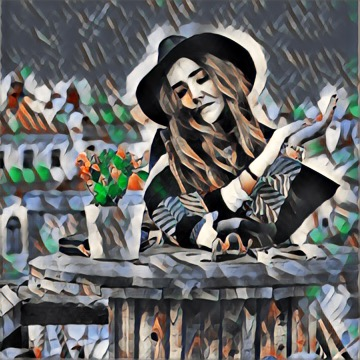
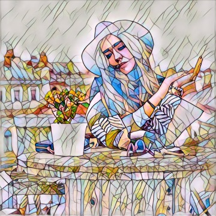

# NFStransfer
a fast-neural-style image transfer demo.

Algorithm is from [fast-neural-style](https://github.com/jcjohnson/fast-neural-style)

Model is from [Convert Torch7 models into Apple CoreML forma](https://github.com/prisma-ai/torch2coreml)

# Original Image

# Transfer Image

